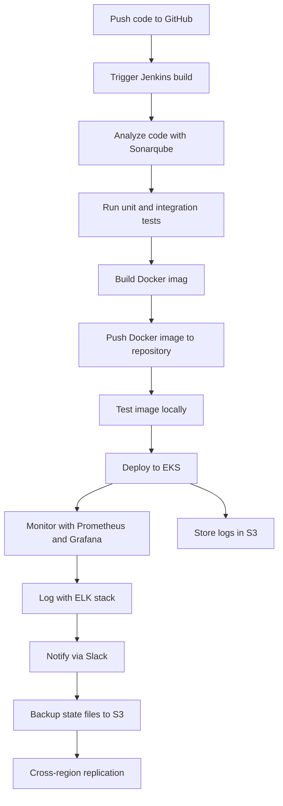

# CI/CD Pipeline Project

## Table of Contents

1. [Project Overview](#project-overview)
2. [Project Objectives](#project-objectives)
3. [Project Aim](#project-aim)
4. [Deployment Strategies](#deployment-strategies)
5. [Tools and Technologies](#tools-and-technologies)
6. [Cloud Infrastructure](#cloud-infrastructure)
7. [Jira Practices](#jira-practices)
8. [Flowchart](#flowchart)
9. [Setup Instructions](#setup-instructions)
10. [Contributing](#contributing)
11. [License](#license)

## Project Overview

This project involves setting up a comprehensive CI/CD pipeline using AWS tools and third-party tools. The aim is to create a scalable, reliable, and fault-tolerant pipeline that can deploy applications across multiple regions, with robust monitoring and logging mechanisms.

## Project Objectives

- Automate the build, test, and deployment processes.
- Ensure code quality and security through continuous integration tools.
- Deploy applications to AWS EKS across multiple regions.
- Implement monitoring and logging for better observability.
- Enable disaster recovery and state management.

## Project Aim

To develop a CI/CD pipeline that enhances the software development lifecycle by automating deployments, improving code quality, and ensuring high availability and disaster recovery across multiple AWS regions.

## Deployment Strategies

- **Blue-Green Deployment**: Reduce downtime and risk by running two identical production environments.
- **Canary Releases**: Gradually roll out changes to a small subset of users before a full release.
- **Horizontal and Vertical Scaling**: Automatically adjust the number of running instances and resources based on traffic and load.
- **Cross-Region Replication**: Ensure high availability and disaster recovery by replicating data and applications across multiple regions.

## Tools and Technologies

- **Version Control**: GitHub
- **CI/CD**: Jenkins
- **Containerization**: Docker
- **Code Quality**: SonarQube
- **Orchestration**: Kubernetes (EKS)
- **Infrastructure as Code**: Terraform
- **Monitoring**: Prometheus, Grafana
- **Logging**: ELK Stack (Elasticsearch, Logstash, Kibana)
- **Secrets Management**: AWS Secrets Manager, HashiCorp Vault
- **Security Scanning**: Snyk, Aqua Security
- **Project Management**: Jira
- **Documentation**: Confluence
- **Communication**: Slack

## Cloud Infrastructure

- **AWS EC2**: For hosting Jenkins and SonarQube.
- **AWS EKS**: For deploying containerized applications.
- **AWS S3**: For storing Terraform state files and build logs.
- **AWS Route 53**: For DNS management and failover routing.
- **AWS CloudWatch**: For logging and monitoring.

## Jira Practices

- **Epics**: Large bodies of work encompassing multiple tasks or stories.
- **Stories**: Descriptions of a feature or functionality from an end-user perspective.
- **Tasks**: Specific pieces of work to be completed.
- **Bugs**: Defects or issues that need to be fixed.
- **Improvements**: Suggestions for enhancements.

### Example Issue Structure:

```
Epic: Project Setup and Planning
  Story: Define project scope and objectives
    Task: Identify tools and technologies for CI/CD pipeline
    Task: Create GitHub repository
  Story: Set up Jira project
    Task: Create new Jira project
    Task: Define issue types and workflows
```

## Flowchart



## Setup Instructions

### Prerequisites

- AWS Account
- GitHub Account
- Jenkins installed on an EC2 instance
- Docker installed on Jenkins EC2 instance
- SonarQube installed on an EC2 instance
- Kubernetes cluster on AWS EKS
- Prometheus and Grafana installed for monitoring
- ELK stack set up for logging
- Terraform installed for infrastructure as code

### Steps

1. **Clone the Repository**:

   ```bash
   git clone
   cd ci-cd-pipeline
   ```

2. **Set Up Jenkins**:

   - Install necessary plugins: Git, Docker, SonarQube.
   - Configure Jenkins credentials for Docker, AWS, and SonarQube.
   - Create Jenkins pipeline job with stages for building, testing, and deploying the application.

3. **Set Up SonarQube**:

   - Install SonarQube on an EC2 instance.
   - Configure SonarQube with Jenkins using the SonarQube Jenkins plugin.

4. **Set Up EKS Cluster**:

   - Create an EKS cluster using the AWS Management Console or Terraform.
   - Configure `kubectl` to connect to the EKS cluster.
   - Deploy the application to EKS using Jenkins.

5. **Configure Monitoring and Logging**:

   - Install Prometheus and Grafana for monitoring.
   - Set up the ELK stack for centralized logging.
   - Integrate Prometheus and Grafana with Jenkins for monitoring pipeline metrics.

6. **Manage Secrets**:

   - Use AWS Secrets Manager or HashiCorp Vault to securely store and manage secrets.

7. **Implement Disaster Recovery**:
   - Configure S3 bucket for storing Terraform state files.
   - Set up cross-region replication for S3 buckets.
   - Configure Route 53 for DNS management and failover routing.

## Contributing

We welcome contributions to improve this project. Please fork the repository and submit pull requests for any enhancements, bug fixes, or documentation updates.

## License

This project is licensed under the MIT License. See the LICENSE file for details.

---
